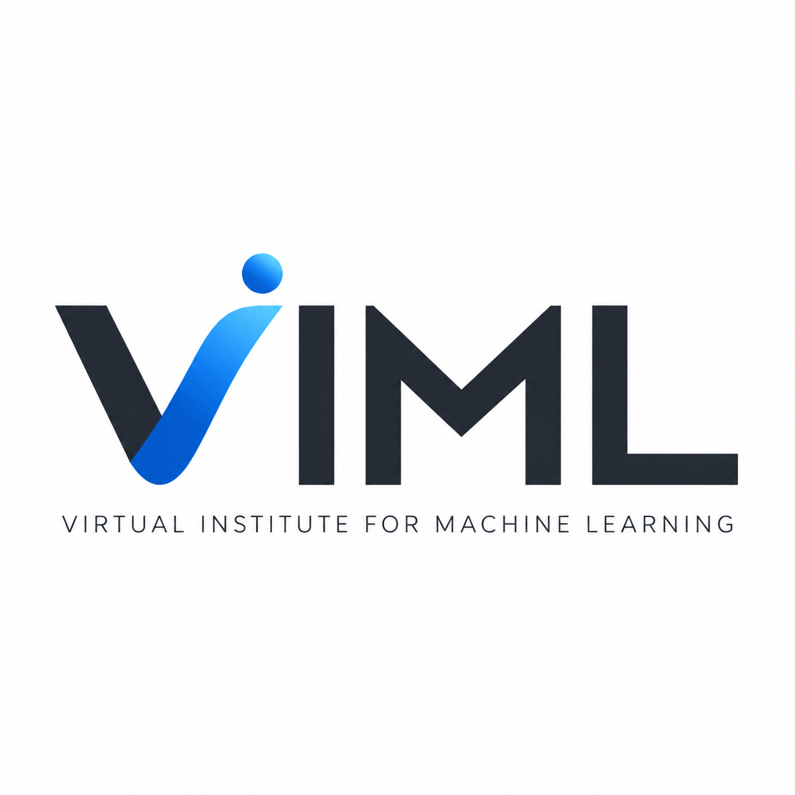

  

<h1 align="center">Virtual Institute for Machine Learning (VIML)</h1>

  Independent research and development in machine learning,
  game AI, scientific computing, and computational science.

  <strong>Remote · Research-driven · Software-oriented</strong>

---

VIML is an independent, virtual research and development initiative exploring
**machine learning, game AI, scientific computing, computational physics,
and computational approaches to complex systems**.

Our goal is to develop research projects that connect
**AI research, scientific computation, software development, and interactive applications**.

## Current Project

### 🃏 Hoola AI

**Hoola AI** is a playable AI research project for
**Hoola (훌라)**, a Korean rummy-style card game.

The project currently includes:

- a deterministic two-player Hoola game engine
- Human, Random, and Heuristic agents
- masked-PPO reinforcement learning
- pretrained reinforcement-learning checkpoints
- training and evaluation tools
- a FastAPI + React playable web interface
- recurrent reinforcement learning with GRU under development

**Repository:**  
[Virtual-Institute-ML/hoola-korean-card-game-ai](https://github.com/Virtual-Institute-ML/hoola-korean-card-game-ai)

**Current releases:**  
`v1.1.0` — first public release  
`v1.2` — GRU-based recurrent agent under development

## Research Areas

- Machine Learning
- Reinforcement Learning
- Game AI and Decision Making
- Scientific Machine Learning
- Scientific Computing
- Computational Physics
- Complex Systems
- Numerical Simulation
- Intelligent Interactive Systems

## Research, Software, and Reproducibility

VIML aims to connect software development with scientific research.

Projects may follow a workflow such as:

**code → trained models → numerical experiments → analysis → public releases → scientific publications**

Whenever appropriate, VIML projects will provide reproducible implementations,
trained models, experiment documentation, and research results.

Selected projects may develop into peer-reviewed research in
machine learning, computational science, and related fields.

## Projects

| Project | Area | Status |
| --- | --- | --- |
| [Hoola AI](https://github.com/Virtual-Institute-ML/hoola-korean-card-game-ai) | Game AI / Reinforcement Learning | Active |
| More projects | Machine Learning / Scientific Computing | Coming soon |

## Website

🌐 **Official VIML website — Coming soon**

The future VIML website will provide a central hub for projects,
research activities, software, publications, and educational content.

## Media

🎥 **VIML YouTube — Coming soon**

The channel will document AI development, numerical experiments,
research ideas, project results, and the development process behind VIML projects.

## Publications

Scientific publications associated with VIML projects will be listed here
as research projects mature.

**Coming soon.**

## License

Licensing may vary by project.

Some VIML projects use the **VIML Research and Non-Commercial License**,
which permits research, educational, and personal non-commercial use while
reserving commercial rights.

Please refer to the `LICENSE` file in each repository for the applicable terms.

---

  <strong>Virtual Institute for Machine Learning (VIML)</strong> 
  Remote · Research-driven · Software-oriented

